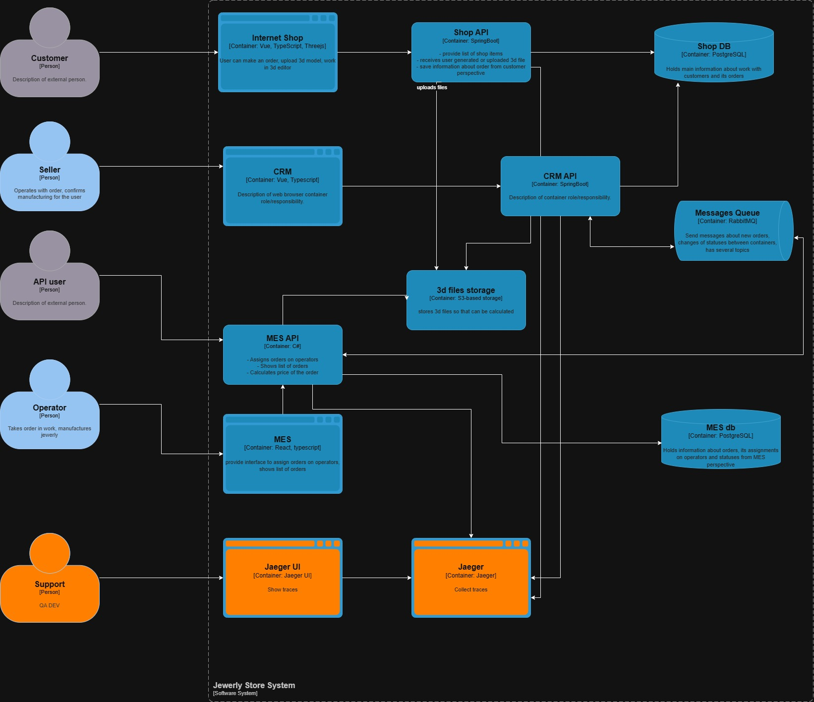

# Архитектурное решение по распределённому трейсингу

## Контекст

В системе регулярно возникают сложности с определением причин, по которым заказы не доводятся до завершения.

Ранее были внедрены механизмы, позволяющие обнаруживать задержки на этапах обработки ещё до обращения клиента в поддержку. Теперь при отклонениях продакт-менеджер оперативно получает уведомление.

Однако выявилась новая проблема: значительная часть инцидентов имеет техническую природу.

В текущем процессе продакт-менеджер, обнаружив техническую аномалию, заводит задачу на QA или разработку. При этом:
- сама проблема уже зафиксирована;
- но поиск её первопричины занимает существенное время;
- требуется воспроизведение сценариев, что особенно затруднительно при нестабильных («плавающих») ошибках.

Это приводит к высоким трудозатратам и увеличению времени устранения инцидентов.

## Требования

Для решения обозначенных проблем необходимо внедрить распределённый трейсинг.

Трейсинг должен покрывать ключевые точки, в которых заказ может «застревать», в первую очередь — переходы между статусами и системами:

- Shop API → MES API (загрузка 3D-модели в S3, расчёт стоимости);
- MES API → RabbitMQ → CRM API (публикация события о завершении расчёта);
- CRM API → RabbitMQ → MES API (подтверждение заказа, назначение исполнителя);

### Данные трейсинга

В рамках трассировки необходимо фиксировать следующие атрибуты:

- `trace_id` — идентификатор цепочки обработки (допустимо использовать `order_id`);
- `span_id` — конкретный этап обработки (например: расчёт, публикация, приём, подтверждение);
- `service_name` — источник события (сервис или система);
- `timestamp` — время начала выполнения операции.

### Дополнительные ограничения

- В трассировку не должны попадать чувствительные данные (персональные, финансовые и иные конфиденциальные сведения);
- Доступ к системе трейсинга (например, Jaeger) должен быть ограничен по принципу минимально необходимых привилегий — только для сотрудников, занимающихся анализом инцидентов.

## Обоснование

Внедрение трейсинга позволит:

- существенно сократить время анализа инцидентов;
- снизить показатель MTTR (Mean Time To Resolve);
- уменьшить количество «зависших» заказов;
- выявлять узкие места в цепочке обработки и принимать решения по оптимизации.

## Предлагаемая реализация

Трейсинг ориентирован в первую очередь на технические команды, однако может частично закрывать задачи бизнес-мониторинга (в случае ограниченных ресурсов на полноценную реализацию).

### Технологический стек

- OpenTelemetry (SDK и Collector);
- Jaeger (интерфейс и хранилище трасс);

### Шаги внедрения

- Развернуть инфраструктуру Jaeger;
- Интегрировать OpenTelemetry в ключевые сервисы (Shop API, MES API, CRM API);
- В перспективе — расширить покрытие на все компоненты системы (API, базы данных, брокеры сообщений);

## Ограничения и компромиссы

- MES является проприетарной системой, что ограничивает глубину интеграции: вероятно, удастся покрыть только точки входа и выхода, без детализации внутренних этапов;
- Интеграция трейсинга на уровне БД и RabbitMQ технически возможна, но требует дополнительных ресурсов и экспертизы, поэтому может быть отложена на последующие этапы.