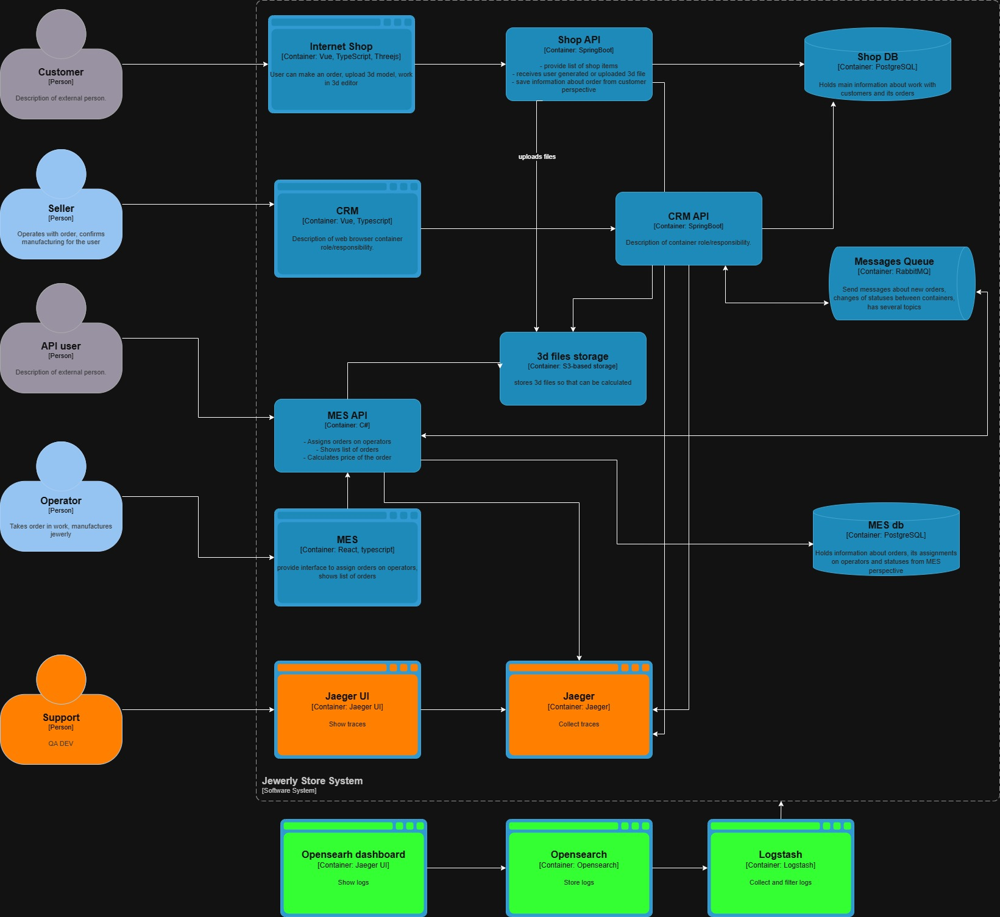

# Архитектурное решение по логированию

## Требования

Ключевая задача логирования — поддержка анализа и устранения технических инцидентов, не связанных напрямую с бизнес-логикой зависания заказов.

Для процессов, связанных с прохождением заказа по системе, уже внедрён трейсинг. Логирование же должно дополнять его и использоваться для диагностики явных технических сбоев.

## Обоснование

Внедрение централизованного логирования позволит:

- ускорить поиск и устранение технических неисправностей;
- оперативно выявлять проблемы после релизов;
- повысить эффективность работы тестирования за счёт возможности анализа поведения системы;

## Предлагаемая реализация

Предлагается организовать централизованный сбор и хранение логов со всех компонентов системы:

- базы данных;
- брокеры сообщений (RabbitMQ);
- веб-серверы (Nginx);
- backend-сервисы;
- frontend-приложения;

### Политика сбора логов

- Минимальный уровень логирования — INFO;
- Обязательный сбор логов уровней ERROR и FATAL;
- Системные события (запуск сервисов, обработка запросов и т.п.) фиксируются на уровне INFO;
- Логи бизнес-событий (например, изменение статуса заказа) добавляются по мере необходимости, при этом основной акцент остаётся на трейсинге;

### Сроки хранения

- На SSD: хранение логов в течение 1 суток;
- На HDD: хранение до 7 суток с последующим удалением;

### Инфраструктура

С учётом размещения системы в облаке:

- Развернуть стек: Logstash + OpenSearch + OpenSearch Dashboards;
- Настроить сбор логов из облачных источников через Logstash;
- Реализовать фильтрацию логов в соответствии с требованиями безопасности;

## Политика безопасности

- Чувствительные данные (персональные, финансовые и т.д.) должны удаляться или маскироваться на этапе обработки в Logstash;
- Для каждой системы используется отдельный индекс;
- Доступ к логам предоставляется разработчикам и QA;
- Доступ реализуется через токены с ограниченным сроком действия (24 часа);

## Анализ логов

Алертинг на основе логов на данном этапе не требуется, поскольку он уже реализован на уровне метрик.

Выявление аномалий (например, резкий рост числа операций) также не является приоритетной задачей для логирования, так как подобные случаи должны фиксироваться системой мониторинга.

В дальнейшем возможно развитие направления анализа логов, например, для задач информационной безопасности и контроля доступа. Однако на текущем этапе внедрение таких механизмов нецелесообразно из-за более приоритетных задач.