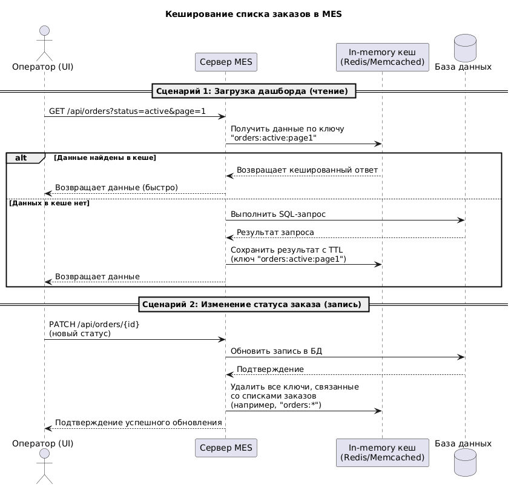

# Архитектурное решение по кэшированию

## Контекст

Увеличилось количество жалоб операторов на медленную загрузку главной страницы MES, представляющей собой дашборд со списком активных заказов.

Ранее реализованные механизмы (фильтрация и пагинация) не обеспечили необходимого уровня производительности. При этом для операторов критично быстро получать доступ к самым свежим заказам, так как это напрямую влияет на их доход.

Таким образом, низкая скорость загрузки негативно сказывается как на эффективности работы сотрудников, так и на общем пользовательском опыте.

## Требования

Необходимо внедрить механизм кэширования, который позволит ускорить получение актуальных данных по заказам без потери их релевантности.

## Обоснование

Кэширование является относительно простым и экономически эффективным способом повышения производительности.

Его внедрение:
- не требует изменения структуры базы данных;
- снижает нагрузку на БД;
- позволяет существенно сократить время ответа системы;

Решаемые проблемы:
- высокая задержка при загрузке дашборда;
- избыточная нагрузка на базу данных.

## Предлагаемое решение

Рассматриваются следующие варианты:

### Клиентское кэширование

Использование браузерного кэширования не подходит, поскольку данные являются динамическими и персонализированными. Требуется централизованный контроль актуальности.

### Серверное кэширование (in-memory)

Оптимальным вариантом является использование in-memory кэша (например, Redis) с паттерном Cache-Aside.

#### Cache-Aside

Подход подразумевает загрузку данных в кэш по мере обращения к ним.

Преимущества:
- простота реализации;
- эффективность при read-heavy нагрузке;
- хорошая совместимость с пагинацией (кэшируются только востребованные страницы).

#### Write-Through

Не рекомендуется, так как приводит к дополнительной нагрузке при каждой операции записи, что критично при частых изменениях статусов заказов.

#### Refresh-Ahead

Имеет повышенную сложность реализации и может приводить к заполнению кэша неиспользуемыми данными.

## Стратегия инвалидации кэша

Для обеспечения актуальности данных предлагается комбинированный подход:

### Event-based инвалидация

При любом изменении состояния заказа происходит очистка всех связанных кэш-ключей.

Преимущества:
- гарантирует актуальность данных при следующем запросе;
- обеспечивает согласованность отображаемой информации.

### TTL (Time-To-Live)

Каждой записи в кэше задаётся время жизни (например, 30–60 секунд).

Назначение:
- резервный механизм на случай, если событие инвалидации не было обработано;

### Обоснование выбора

- Использование только TTL не подходит, так как данные могут устаревать в пределах времени жизни записи;
- Использование только событийной инвалидации требует высокой надёжности событийной модели;
- Комбинированный подход обеспечивает баланс между актуальностью и устойчивостью.